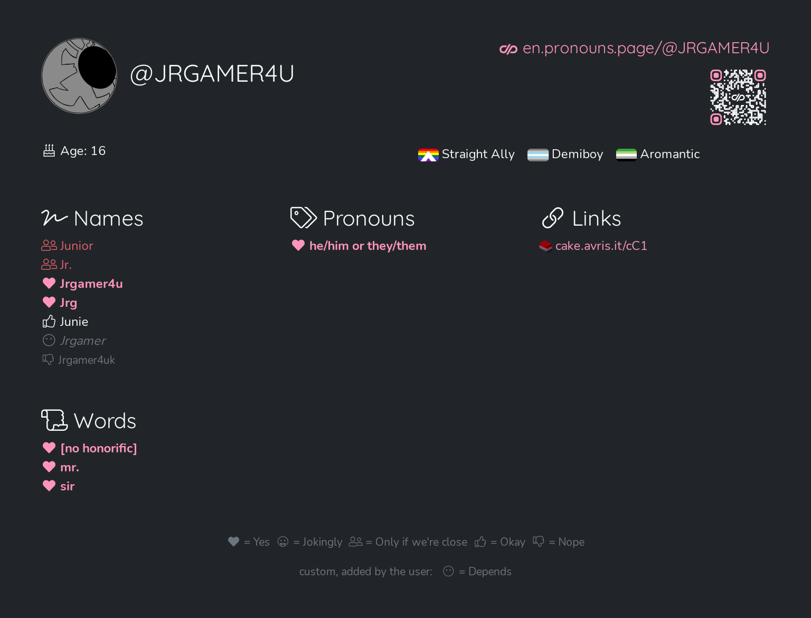

<main align="center">
<h1>
	Currently using this as my website now.
</h1>

 

 

 

<h2>
	Upcoming Projects
</h2>

FNKNGT Version 2 Friday Night Funkin Mod
 

Potential Python Discord Bot

<h2>
	Current Projects
</h2>

MipMachine EX & OBR Legacy (Discord Bot):
 

<h2>
	Previous Projects
</h2>

BarBot 4 and Recovery Centere 2 (Discord Bot):
 

 

Simple English (Twitter Bot):
 

 

FNKNGT Friday Night Funkin Mod (now private)
 

Marsan's The Battle For Someone's Money (Episode 1, now private)
 

<a href="https://www.youtube.com/playlist?list=PLJCLnmjnTOghhlyRSsvw0GwYgiV8k3LQO">
	Battle For The Word Universe (Season 1 to 3)
</a>
 

<a href="https://www.youtube.com/playlist?list=PLJCLnmjnTOgh0EmpQweS0XiLin6sK-1v-">
	Fail Bob (0 to 3)
</a>
 

<a href="https://www.youtube.com/playlist?list=PLJCLnmjnTOgjCT1S0AyepaOKTqNqQedQy">
	Leaks Timeline (Week 7 to 10)
</a>
 

<a href="https://www.youtube.com/playlist?list=PLJCLnmjnTOgirFN_uPbwcRt2W9s35B4Xh">
	Longest Stream On Youtube (Part 1 to 20)
</a>

</main>
